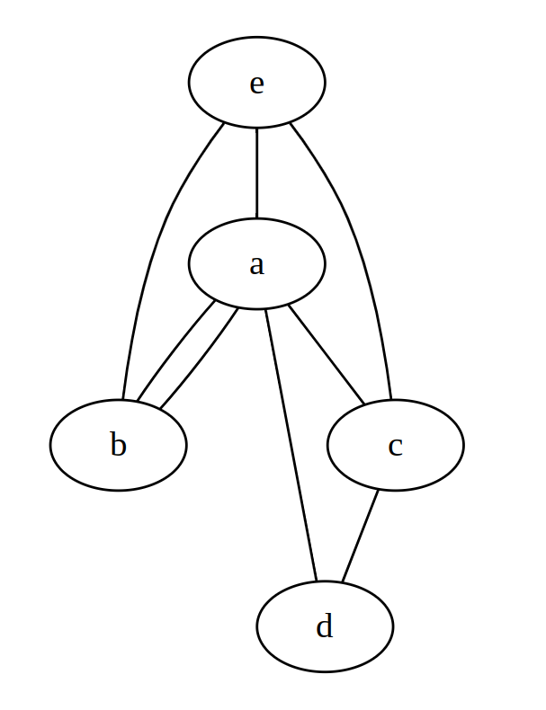

# PAH23: Making connections open, easier and scalable

Welcome to ProbinAlo Hackathon 2023 project repository. Good luck everyone!  

# Table of Contents
1. [Introduction](#introduction)
2. [Tools](#tools)
3. [Project Requirements](#requirements)
    1. [User Profile](#profile)
        


<a name="introduction"></a>
## Solution Project: A Node Simulator
### At a glance: 
- A Web App
- Visualized Data
- User Control to Create 
- Expandable Ideas
<a name="tools"></a>
### Suggested tools:


_Demo image of a graph visualizer_

<a name="requirements"></a>
## Project Requirements 
<a name="profile"></a>
1. User account creation.
    
    #### Fields:
    - Username
    - Email
    - Password
    - Number of projects/models user has created

    #### Possible login methods:
    - Passwords
    - Two-Factor Authentication (not mandatory)

2. Must save user progress. Should contain undo, redo and etc. options.
3. Must have buttons that let user create nodes and edges with data.
4. Shows visual representation of nodes and edges with data. Easily visible data is priority in the representation.
5. Try creating most things as an API, so that it is reusable.  

# Representing Graphs

Let $nodes$ be an array containing the each nodes. Here, each node has a string value.

Let $edges$ be an array containing the edges between each nodes. This array contains arrays containing the index denoting an edge between node. $i$-th array in this $edges$ array represents the edge list of the node in the same index of $nodes$ array.


Example:



This graph can be represented like this:

`nodes = [Node {a}, Node {b}, Node {c}, Node {d}, Node {e}]`

`edges = [[1, 2, 3, 4], [0, 4], [0, 3, 4], [0, 2], [0, 1, 2]]`

Note that bidirectional edges can also be represented in this format.

## Serializing the graph to binary format

| Name    | Description                          | Position       | Type  |
| ------- | ------------------------------------ | -------------- | ----- |
| n_size  | Total size in bytes of $nodes$ array | 0x0            | u64   |
| n_array | List of null terminated strings.     | 0x8            | bytes |
| e_size  | Total size in bytes of $edges$ array | $8 + n\\_size$  | u64   |
| e_array | Array of edge list.                  | $16 + n\\_size$ | bytes |

### Representation of `e_array`

| Name        | Description                                 | Position                    | Type  |
| ----------- | ------------------------------------------- | --------------------------- | ----- |
| e_list_size | Size of the edges list                      | To be determined at runtime | u64   |
| e_list      | List containing indexes to nodes in $nodes$ | To be determined at runtime | u64[] |

Each item in `e_array` are put one after another. So that means, it'll look like this:

```
0x0 0x0 0x0 0x0 0x0 0x0 0x0 0xF  -
0x0 0x0 0x0 0x0 0x0 0x0 0x0 0xA   | -> First e_list
0x0 0x0 0x0 0x0 0x0 0x0 0x0 0xB  -
0x0 0x0 0x0 0x0 0x0 0x0 0x0 0x8  -
0x0 0x0 0x0 0x0 0x0 0x0 0x0 0xA  -| -> Second e_list
```

The bytes represent the following `e_array`:

`[[10, 11], [10]]`

Here, the position of the first `e_list` is $e\\_array\\_pos + 8$. The position of the second `e_list` is $e\\_array\\_pos + 8 + 16 + 8$.

